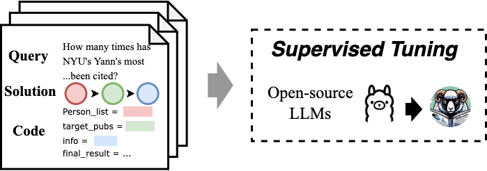

# Training of SoAyLLaMA
> by WangYC

SOAYLLaMA is designed for supervised finetuning of open-source models when training resources are available. Through the training stage,SOAYLLaMA integrates an API description and queries as inputs and combines solutions and programs as responses. During the inference stage, SOAYLLaMA concurrently completes the Planning and Formatting processes to derive solutions and code. Similar to SOAYGPT, it utilizes the environment to execute and obtain answers based on K.

We conduct the fine-tuning on 3 different variants of LLaMA Model, respectively Chat-7B: Llama-2-7b-chat-hf2, Code-7B: CodeLlama-7b-Instruct-hf3,Code-13B: CodeLlama-13b-Instruct-hf4.


## Fine-tuning
```
bash scripts/finetune_ds.sh
```
## Inference
create a inference config file:
```
{
    "save_path" : "path-to-model", # without / at tail
    "llm_name" : "soayllama_v2_7b",
    "checkpoint_iteration" : "1500",
    "test_dataset_path" : "path-to-dataset", # without / at tail
    "inference_mode" : "interaction"
}
```
### API
```
python api.py
```
### SoAyBench or Terminal Interaction
```
bash inference.sh
```
The model is trained on a specific format of "[INST]" + bg_text + prompt + "\n-----\n[/INST]"

So if you want to download the model from hugginface and use it to generate AMiner-API-Calling code, you may use the function below:
```
def code_gen_llm(prompts, llm):

    bg_text = "Background:\n\nHere are some tool functions you can use. Each function returns a dict or a list of dict.\n------\nsearchPerson(name, organization, interest):\n    person_list = [{'person_id': str, 'name': str, 'num_citation': int, 'interests':list of str, 'num_pubs': int, 'organization': str}, {...}]\n    return person_list\n---\nsearchPublication(publication_info)\n    publication_list = [{'pub_id': str, 'title': str, 'year': time}, {...}]\n    return publication_list\n---\ngetCoauthors(person_id):\n    coauthors_list = [{'person_id': str, 'name': str, 'relation': ['advisor' or 'advisee' or 'coauthor']}, {...}]\n    return coauthors_list\n---\ngetPersonInterest(person_id):\n    return interest_list\n---\ngetPersonPubs(person_id):\n    publication_list = [{'authors_name_list':list of str, 'pub_id':str, 'title':str, 'num_citation':int, 'year':str}]\n    return publication_list\n---\ngetPersonBasicInfo(person_id):\n    person_basic_info = {'person_id': str, 'name': str, 'gender': str, 'organization':str , 'position': str, 'bio': str, 'education_experience': str, 'email': str}\n    return person_basic_info\n---\ngetPublication(pub_id)\n    publication_info = {'abstract' : str, 'author_list': [{'person_id': str, 'name': str, 'organization': str}, {...}], 'num_citation': int, 'year' : int, 'pdf_link': str, 'venue' : str}\n    return publication_info\n------\nYou are given a query. Parse the query into a combination of the given query and write python codes in order to solve it. \nNote that the result must be one of these combination candidates:\nsearhPerson\nsearchPublication\nsearchPerson -> getCoauthors\nsearchPerson -> getPublication\nsearchPerson -> getPersonBasicInfo\nsearchPublication -> getPublication\nsearchPerson -> getCoauthors -> searchPerson\nsearchPerson -> getCoauthors -> getCoauthors\nsearchPerson -> getCoauthors -> getPersonInterest\nsearchPerson -> getPersonPubs -> getPublication\nsearchPublication -> getPublication -> getPersonInterest\nsearchPublication -> getPublication -> getCoauthors\nsearchPublication -> getPublication -> getPersonPubs\nsearchPublication -> getPublication -> getPersonBasicInfo\nsearchPublication -> getPublication -> searchPerson\n\n-----\nQuery:\n"

    new_prompts = []

    for prompt in prompts:
        new_prompt = "[INST]" + bg_text + prompt + "\n-----\n[/INST]"
        new_prompts.append(new_prompt)

    sampling_params = SamplingParams(temperature=0, top_p=0.95, max_tokens=512)

    bg_time = time.time()
    outputs = llm.generate(new_prompts, sampling_params)
    generated_txt_list = []
    for each in outputs:
        generated_txt_list.append(each.outputs[0].text)
    end_time = time.time()
```